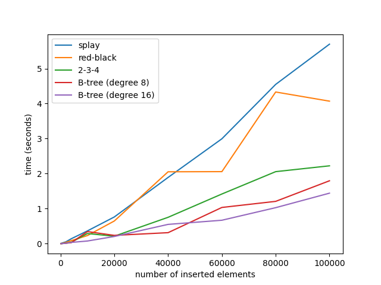

# Balanced Trees in Python

## Introduction

This repo provides implementations of some balanced trees.
For now, B tree, Red-Black tree and Splay are implemented.
A benchmark of these algorithms are provided.

## Limitation

This is only a project for programming practice.
Don't use the code to any production environment, or you take your own risk.

Known issues:
- B Tree cannot insert duplicate elements.

## Benchmark

Two experiments are benchmarked.

- Insert n elements.

- Insert n elements. Then delete n elements. Then insert n elements.

